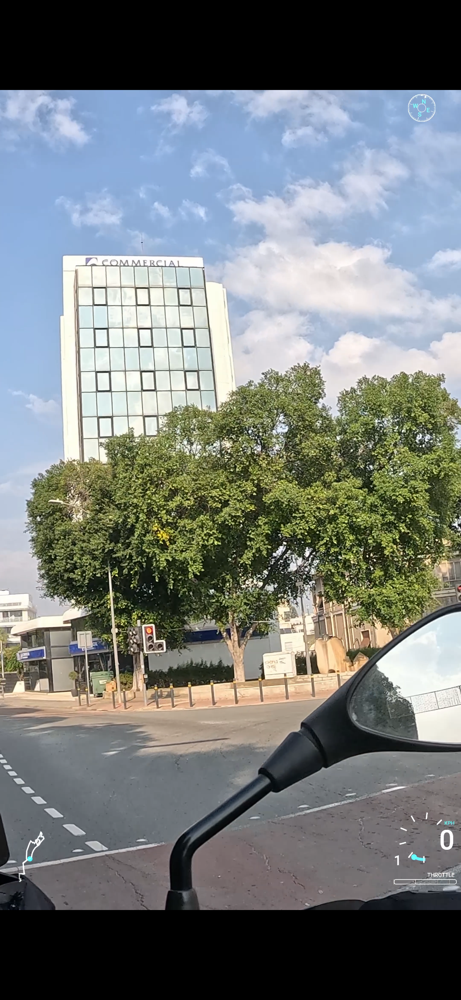

## WunderLINQ support

This fork adds built‑in support for the BlackBoxEmbedded **[WunderLINQ](https://www.blackboxembedded.com)** hardware used on BMW motorcycles.  The device records speed, RPM, gear, temperatures, tyre pressures, fuel range and many other values in CSV format.  To use these metrics in your overlays:

1. **Convert WunderLINQ CSV to GPX.**  A patched version of the [`gpx-converter`](https://github.com/nidhaloff/gpx-converter) library reads the WunderLINQ CSV schema and writes custom GPX extensions (namespace `https://wunderlinq.local/ns/1`).  Non‑numeric values (like VIN or gear) are preserved as strings.  After converting, pass the generated GPX file to `gopro-dashboard.py` as usual.
The modifications used here live in **[this fork of gpx-converter](https://github.com/zenonasz/gpx-converter)** and are considered part of the overall WunderLINQ → GPX → overlay workflow.

2. **Parse custom GPX extensions.**  
In this fork, the `fudge()` function reads every GPX extension element, storing unrecognised fields in an `extras` dictionary.  
`with_unit()` then performs a best-effort normalisation into `pint` quantities based on field suffixes (e.g. `_kmh`, `_m`, `_km`, `_c`, `_deg`, `_bar`, `_kpa`, `_v`, `_rpm`).  
Telemetry exported from the WunderLINQ app may use different unit preferences (e.g. km/h vs mph, °C vs °F, km vs miles).  
At present, the normalisation logic explicitly covers metric-based suffixes only. Support for imperial units (e.g. `_mph`, `_mi`, `_f`) is not yet implemented, but the extension model is designed to support this cleanly.  
The expected approach is that the GPX conversion step preserves the original unit in the extension field name (for example `_mph` instead of `_kmh`), after which `with_unit()` can be extended with additional suffix mappings to normalise those values in the same way.
Note: the current implementation always preserves WunderLINQ fields with a `wlinq_` prefix, while other namespaces fall back to using the element local name only (e.g. `<vendor:sensor_value>` becomes `sensor_value`).  
If you want to support multiple namespaces safely (to avoid name collisions and to expose fields as `vendor_sensor_value`), you should extend the namespace-to-prefix mapping in `gopro_overlay/gpx.py` (see `WLINQ_URI` handling inside `fudge()`), and optionally extend `with_unit()` suffix mappings for any additional units.


3. **Expose metrics on `Entry`.**  When converting a GPX file to a time series, the `gpx_to_timeseries()` helper merges the `extras` dictionary into each `Entry`, so fields like `wlinq_rpm` or `wlinq_front_tire_pressure_bar` can be referenced directly in layouts.

4. **New layout metrics and widgets.**  The XML parser (`layout_xml.py`) has been extended with metric accessors for each WunderLINQ field (speed, engine temp, tyre pressures, fuel consumption, battery voltage, lean angle, bearing, etc.).  A new `create_text_metric()` helper renders string values (e.g. current gear).  Two new compass widgets (`create_compass_metric()` and `create_compass_arrow_metric()`) draw a compass dial and pointer using heading/bearing values from WunderLINQ sensors.

### Summary of code changes

- Extended `fudge()` to capture **all** GPX extension values and store unknown fields in `extras`.
- Added unit conversion for `extras` fields in `with_unit()`, with sensible defaults for speed, distance, temperature, pressure, voltage and percentages.
- Modified `gpx_to_timeseries()` to merge `extras` into each `Entry`.
- Added a text accessor (`text_accessor_from`) and `create_text_metric()` widget for displaying string metrics like gear and VIN.
- Added new metric accessors in `metric_accessor_from()` for all WunderLINQ values (RPM, tyre pressure, odometer/trip counters, throttle/brakes, engine/ambient temperature, fuel economy, lean angle, bearing, battery voltage, etc.).
- Added compass widgets to visualise heading/bearing and orientation.
- Patched the `gpx-converter` dependency to convert WunderLINQ CSV logs into GPX with the correct namespace and data types.

### New layouts and configuration

Three example layouts tailored for WunderLINQ data are provided under `examples/layout/wunderlinq`:

- `adventure-4k-3840x2160_map.xml`  
- `adventure-4k-3840x2160.xml`  
- `adventure-v4k-2160x3840.xml`

## Example



A corresponding `config` directory contains sample configuration files for maps, fonts, colours and FFMPEG profiles.  You can point the dashboard at this directory with `--config-dir config/` during testing, or copy its contents into your to another folder for amendments and a permanent use.

### Building and running

This fork can be installed and run using either the upstream `pip`/`venv` instructions or the faster `uv` workflow described above.  Both approaches are fully supported.

#### Local development (editable install)

For local development, the project can be installed in editable mode so that code changes are picked up immediately:

```bash
python -m venv .venv
source .venv/bin/activate
pip install -U pip setuptools wheel
pip install -e .

```

### Optional (using`uv`)


The same editable workflow is supported when using `uv` (`uv pip install -e .`).

```bash

uv venv --python 3.11 
uv pip install -e .
```

Here are some example commands:

- **Preview a layout** (no video output):

```bash

gopro-layout.py examples/layout/wunderlinq/adventure-v4k-2160x3840.xml \
    --overlay-size 2160x3840 \
    --config-dir config/
```

example using uv, run with 'uv run <command>'

```bash
uv run gopro-layout.py examples/layout/wunderlinq/adventure-v4k-2160x3840.xml \
    --overlay-size 2160x3840 \
    --config-dir config/
```

- **Generate a video** (overlay rendered on top of a GPX track):

```bash

gopro-dashboard.py --use-gpx-only \
  --gpx /path/to/your-converted-file.gpx \
  --layout xml \
  --layout-xml examples/layout/wunderlinq/adventure-v4k-2160x3840.xml \
  --overlay-size 2160x3840 \
  --config-dir config/ \
  --debug-metadata \
  output-path/output.mov
```


For further tips on configuring FFMPEG profiles, choosing overlay sizes and rendering videos efficiently, see this blog post on romainpellerin.eu about creating GPX overlay [videos on Linux](https://romainpellerin.eu/creating-gpx-overlay-videos-on-linux.html)
. It describes how to prepare a GPX file, select a map style, adjust frame rate and bitrate via a JSON profile, and tune performance on different hardware. While the layouts in that article differ from the WunderLINQ examples, the general guidance on command‑line flags and configuration files applies equally to this fork.

Although this fork currently focuses on WunderLINQ telemetry, the changes introduced here are intentionally generic.  
The same approach may evolve into a more general GPX workflow for handling custom extension namespaces, where external devices or data sources expose additional telemetry via `<extensions>` elements and layouts consume those values without requiring changes to the core rendering pipeline.


---


# Create video overlays from GoPro Videos or any GPX/FIT file

<a href="https://github.com/time4tea/gopro-dashboard-overlay/discussions"></a>
<a href="https://pypi.org/project/gopro-overlay/"></a>
<a href="https://hub.docker.com/r/overlaydash/gopro-dashboard-overlay"></a>

Discuss on [GitHub Discussions](https://github.com/time4tea/gopro-dashboard-overlay/discussions)

- Overlaying exciting graphics onto GoPro videos with super-exact synchronization
- Create videos from any GPX or FIT file - no GoPro required
- Support multiple resolutions, most GoPro models, normal, timelapse & timewarp modes
- Support GPUs to create movies at up to 17x realtime
- Convert GoPro movie metadata to GPX or CSV files
- Cut sections from GoPro movies (including metadata)
- Linux, Mac, Windows!

## Introduction Video

[](https://www.youtube.com/watch?v=qTwPVjNXJ8o)

## Examples


An Example of 'overlay only' mode, which generates movies from GPX files


Example from [examples/layout](examples/layout)


## Map Styles

Almost 30 different map styles are supported! - See [map styles](docs/maps/README.md) for more

*Example*

| .                                   | .                                             | .                                                     | .                                                     |
|-------------------------------------|-----------------------------------------------|-------------------------------------------------------|-------------------------------------------------------|
|  |  |  |  |


## Requirements

- Python3.10 (development is done on Python3.11)
- ffmpeg (you'll need the ffmpeg program installed)
- libraqm (needed by [Pillow](https://pypi.org/project/Pillow/))

## Installation

For Windows, please see docs [docs/windows.md](docs/windows.md)

For Docker, please see docs at [docs/docker.md](docs/docker.md)

Install locally using `pip`, or use the provided Docker image

Optional: Some widgets require the `cairo` library - which must be installed separately.


### Installing and running with pip

```shell
python -m venv venv
venv/bin/pip install gopro-overlay
```

The Roboto font needs to be installed on your system. You could install it with one of the following commands maybe.

```bash
pacman -S ttf-roboto
apt install truetype-roboto
apt install fonts-roboto
```

#### (Optional) Installing pycairo

Optionally, install `pycairo`

```shell
venv/bin/pip install pycairo==1.23.0
```

You might need to install some system libraries - This is what the pycairo docs suggest: 

Ubuntu/Debian: `sudo apt install libcairo2-dev pkg-config python3-dev`

macOS/Homebrew: `brew install cairo pkg-config`

### Example

For full instructions on all command lines see [docs/bin](docs/bin)

```shell
venv/bin/gopro-dashboard.py --gpx ~/Downloads/Morning_Ride.gpx --privacy 52.000,-0.40000,0.50 ~/gopro/GH020073.MP4 GH020073-dashboard.MP4
```

## Caveats

The GPS track in Hero 9 seems to be very poor. If you supply a GPX file from a Garmin or whatever, the
program will use this instead for the GPS. Hero 11 GPS is much improved.

Privacy allows you to set a privacy zone. Various widgets will not draw points within that zone.

The data recorded in the GoPro video will uses GPS time, which (broadly) is UTC. The renderer will use your local
timezone to interpret this, and use the local timezone. This may produce strange results if you go on holiday somewhere,
but then render the files when you get back home! On linux you can use the TZ variable to change the timezone that's
used.

## Writeups

There's a great writeup of how to use the software to make an overlay from a GPX file at https://blog.cubieserver.de/2022/creating-gpx-overlay-videos-on-linux/
(Nov 2022)

### Format of the Dashboard Configuration file

Several dashboards are built-in to the software, but the dashboard layout is highly configurable, controlled by an XML
file.

For more information on the (extensive) configurability of the layout please see [docs/xml](docs/xml) and lots
of [examples](docs/xml/examples/README.md)

## FFMPEG Control & GPUs

FFMPEG has **a lot** of options! This program comes with some mostly sensible defaults, but to use GPUs and control the
output much more carefully, including framerates and bitrates, you can use a JSON file containing a number of 'profiles'
and select the profile you want when running the program.

For more details on how to select these, and an example of Nvidia GPU, please see the guide in [docs/bin#ffmpeg-profiles](docs/bin#ffmpeg-profiles)

Please also see other docs [PERFORMANCE.md](PERFORMANCE.md) and [docs/bin/PERFORMANCE_GUIDE.md](docs/bin/PERFORMANCE_GUIDE.md)

## Converting to GPX files

```shell
venv/bin/gopro-to-gpx.py <input-file> [output-file]
```

## Joining a sequence of MP4 files together

Use the gopro-join.py command. Given a single file from the sequence, it will find and join together all the files. If
you have any problems with this, please do raise an issue - I don't have that much test data.

The joined file almost certainly won't work in the GoPro tools! - But it should work with `gopro-dashboard.py` - I will
look into the additional technical stuff required to make it work in the GoPro tools.

*This will require a lot of disk space!*

```shell
venv/bin/gopro-join.py /media/sdcard/DCIM/100GOPRO/GH030170.MP4 /data/gopro/nice-ride.MP4
```

## Cutting a section from a GoPro file

You can cut a section of the gopro file, with metadata.


## Help Wanted

- Adding additional graphics widgets, ideally using cairo.
- Validation / Improvement of smoothing - e.g. Kalman Filters
- Suggestions for handling acceleration and orientation data, this is parsed, but display options are few.

## Work In Progress

- Adding min/max/moving averages to metrics

## Related Software

- https://github.com/julesgraus/interactiveGoProDashboardTool - An interactive helper to build the command line for the dashboard program

## Known Bugs / Issues

- Only tested on a GoPro Hero 9/11, that's all I have. Sample files for other devices are welcomed.

## Icons

Icon files in [icons](gopro_overlay/icons) are not covered by the MIT licence

## Map Data

Data © [OpenStreetMap contributors](http://www.openstreetmap.org/copyright)

Some Maps © [Thunderforest](http://www.thunderforest.com/)

## References

https://github.com/juanmcasillas/gopro2gpx

https://github.com/JuanIrache/gopro-telemetry

https://github.com/gopro/gpmf-parser

https://coderunner.io/how-to-compress-gopro-movies-and-keep-metadata/

## Other Related Software

https://github.com/progweb/gpx2video

https://github.com/JuanIrache/gopro-telemetry

## Latest Changes

If you find any issues with new releases, please discuss in [GitHub Discussions](https://github.com/time4tea/gopro-dashboard-overlay/discussions)
- 0.129.0 [Enhancement] [Breaking] - Update python compatibility - Newly Compatible: 3.13, 3.14. No longer compatible 3.9, 3.10 
- 0.128.0 [Enhancement] add layout default compatible ith DJI 2.5k resolution. Thanks to [@DonkeyShine](https://github.com/DonkeyShine) for suggestion.
- 0.127.0 [Enhancement] Now support _respiration_ , _front_gear_num_ and _rear_gear_num fields in FIT files. Improved support for using DJI videos as files to be overlaid. 
  - Thanks to [@prebbz](https://github.com/prebbz) [@DonkeyShine](https://github.com/DonkeyShine) 
- 0.126.0 [Enhancement] New Motorspeed widgets - "msi" & "msi2" - See examples [docs/xml/examples/07-motor-speed-indicator/README.md](docs/xml/examples/07-motor-speed-indicator/README.md) - Thanks to [@JimmyS83](https://github.com/JimmyS83) for contributing.
  - New metric `accel` which is computed from speed deltas, rather than gopro accelerometer. Thanks also to [@JimmyS83](https://github.com/JimmyS83)
  - [Breaking] Ordering of fields in gopro-to-csv has changed, with addition of `accel` field
- 0.125.0 [Fix] Improved error messages with invalid font sizes. Thanks [@dyk74](https://github.com/dyk74) for raising.
- 0.124.0 [Enhancement] Attempt to work around some GPS Issues, particularly https://github.com/time4tea/gopro-dashboard-overlay/issues/141 https://github.com/time4tea/gopro-dashboard-overlay/issues/22
- 0.123.0 [Enhancement] Use better (but every so slightly slower, shouldn't make a huge difference) rotation method for maps - will give much better quality.
  - Add new gauge - `cairo-gauge-donut` see [docs/xml](docs/xml/examples/06-cairo-gauge-donut)
  - It looks like this: 
- 0.122.0 [Breaking] Previous change announced in v0.100.0 wasn't actually taking effect. Use --gpx-merge OVERWRITE to prefer values in gpx to gopro.
- 0.121.0 [Enhancement] Build in some simple ffmpeg profiles - `nvgpu`, `nnvgpu`, `mov`, `vp8`, and `vp9` - see [docs/bin#ffmpeg-profiles](docs/bin#ffmpeg-profiles)
- 0.120.0 [Fix] Resolve some Python3.10 compatibility issues. Thanks, [@KyleGW](https://github.com/KyleGW)
- 0.119.0 [PyPI Changes Only] Update README in PyPI so links should work
- 0.118.0 [Enhancement] Local Map Tiles are now cached in memory, so hugely more performant (affects `--map-style local` only)
- 0.117.0 [Enhancements] Tentative support for Python 3.12. Thanks to [@JimmyS83](https://github.com/JimmyS83) for the suggestion. Also some small bugfixes for waiting for ffmpeg, and also hopefully removing error message about shared memory using `--double-buffer`
- 0.116.0 [Docker Changes Only] Support GPU in docker image. See [docs/docker.md](docs/docker.md) Thanks to [@danielgv93](https://github.com/danielgv93) for suggestion.

Older changes are in [CHANGELOG.md](CHANGELOG.md)

